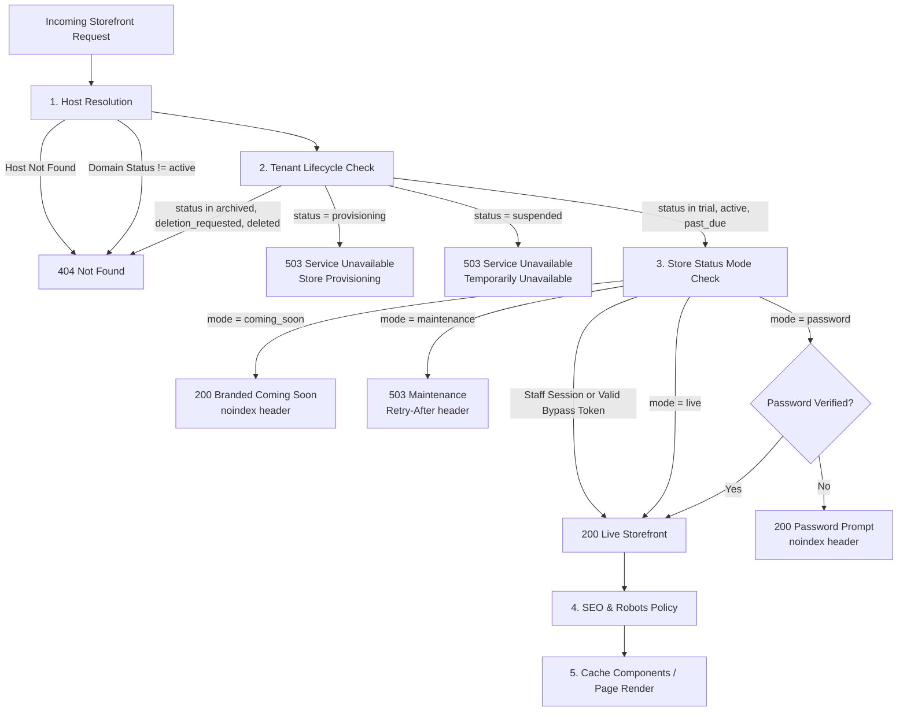

# M3 Design Spec: Storefront Sells the Catalog

**Date:** 2026-09-28  
**Status:** Approved (Approach 1 with Amendments)  
**Milestone:** M3 · Storefront sells the catalog  
**Context:** PLAN.html §10, §8.2, §8.3, §11.6, §6.4; BUILD-PLAN-M2-M9.md §M3  

---

## 1. Executive Summary & Scope

M3 activates the public-facing storefront for multi-tenant stores on their platform subdomains (and future custom domains). Merchants have already authored products, variants, collections, categories, media, inventory, themes, branding, and block-based pages in M2. M3 enables visitors to browse the catalog, search products, view rich product pages with variants and JSON-LD structured data, manage their cart, and proceed through a complete checkout UI flow, all under strict tenant isolation and high-performance caching.

### In Scope
1. **Storefront Routes:**
   - `/` — Home page rendered from active theme and published home block document with dynamic cart badge.
   - `/products/[slug]` — Product detail page with gallery, variant picker, stock/ETA Suspense hole, related products, and JSON-LD `Product`.
   - `/collections/[slug]` & `/categories/[slug]` — Catalog listings with filtering, sorting, pagination, and JSON-LD `ItemList`.
   - `/search` — Full-text + trigram search powered by PostgreSQL with query logging to `search_queries`.
   - `/cart` — Dynamic cart page with item updates, totals, and pincode shipping estimation.
   - `/checkout` — Single-page checkout UI flow: Contact (phone first) → Address (pincode autofill) → Shipping rate → Payment method selection (Razorpay / COD UI) → Place order stub.
   - `/pages/[slug]` — Custom block pages with render-time block migration and validation.
   - `/blog` & `/blog/[slug]` — Content blog and article pages with JSON-LD `Article`.
   - `/policies/[type]` — Legal and store policies (privacy, terms, refund, shipping).
   - `/sitemap.xml` & `/robots.txt` — Dynamic SEO routes cached per tenant with AI crawler controls.
2. **Tenant Lifecycle & Store Status Request Lifecycle:**
   - 5-step request lifecycle: Host resolution → Tenant lifecycle check (PLAN §6.4) → Store status mode check (PLAN §8.2: live, coming_soon, maintenance, password) → SEO headers (`X-Robots-Tag`, `noindex`) → Page render.
   - Staff preview link and bypass token support.
3. **Database Schema & RLS:**
   - `store_status`, `seo_settings`, `search_queries`, `newsletter_subscribers`, `carts`, `cart_items`.
   - All created with `tenantTable()`, composite FKs, tenant-first indexes, and explicit `FORCE ROW LEVEL SECURITY`.
4. **Cache Components Invalidation Matrix (PLAN §11.6):**
   - Strictly enforced tenant-prefixed tags (`t:{tenantId}:[kind]:[id?]`).
   - Domain event triggers and manual revalidation for products, collections, categories, theme, nav, pages, and SEO.
5. **Render-Time Block Migration & Validation (ADR-009 Amendment):**
   - Public rendering path runs `migrateBlockDocument()` and `validateBlockDocument()` before rendering blocks.
6. **Performance Budget:**
   - Lighthouse mobile score ≥ 90 on product page baseline.
   - LCP < 2.0s on 4G mid-range Android, CLS < 0.05, INP < 200ms, product-page JS < 100KB gzipped.

### Explicitly Excluded (Deferred)
- Real payment capture and atomic order placement with number sequences and stock reservation (M4).
- Customer accounts and customer session login/OTP flow (M4).
- Abandoned-cart recovery background jobs and discount engine (M5).
- Custom domains via Cloudflare for SaaS (M8 — M3 resolves platform subdomains via `domains`).
- Typesense search integration (deferred scale-out).

---

## 2. Request Lifecycle State Machine

Storefront requests follow a strict 5-stage pipeline:



### Detailed Lifecycle Rules (PLAN §6.4 & §8.2)

1. **Host Resolution (`resolveHostToTenant`):**
   - Resolves `Host` or `X-Forwarded-Host` header against `domains` joined with `tenants`.
   - Domain must have `status = 'active'`.
   - Result is cached in-memory with a 60s TTL.

2. **Tenant Lifecycle (PLAN §6.4):**
   - `provisioning` → Returns HTTP 503 with branded "Store is being provisioned" screen.
   - `suspended` → Returns HTTP 503 with branded "This store is temporarily unavailable" message.
   - `archived`, `deletion_requested`, `deleted` → Returns HTTP 404 Not Found.
   - `past_due` → Served normally (merchant is in 7-day grace period; admin displays dunning banner).
   - `trial`, `active` → Proceeds to store status check.

3. **Store Status Modes (PLAN §8.2):**
   - Evaluates `store_status` table for the tenant.
   - **Bypass condition:** If the visitor is authenticated as store staff (`session.type === 'staff'`) OR supplies a valid preview token (`?preview_token=...` matching `store_status.bypass_token_hash` or cookie `bs_preview`), the visitor views the full storefront with a floating banner indicating the store's current mode.
   - **Modes for non-bypassed visitors:**
     - `live`: HTTP 200, normal storefront rendered.
     - `coming_soon`: HTTP 200, branded launch page with logo, headline, countdown (if `show_countdown`), email signup (saves to `newsletter_subscribers`), social links, and `X-Robots-Tag: noindex`.
     - `maintenance`: HTTP 503, branded "Back soon" page with merchant message and `Retry-After: {retry_after_minutes * 60}` header (ensures search engines retain rankings).
     - `password`: Checks cookie `bs_store_password`. If invalid or missing, renders password prompt with `X-Robots-Tag: noindex`. If valid, proceeds to page render.

4. **SEO & Robots Enforcement (PLAN §8.3):**
   - If `seo_settings.indexing_enabled === false`, OR store status is `coming_soon` or `password`:
     - Injects `<meta name="robots" content="noindex, nofollow" />`.
     - Injects HTTP response header `X-Robots-Tag: noindex, nofollow`.
     - In `robots.txt`, returns `User-agent: *\nDisallow: /`.

---

## 3. Database Schema & RLS Policies

All M3 tables reside in `packages/db/src/schema/` and are registered in `tenantTableNames`. Every table uses `tenantTable()` and includes `FORCE ROW LEVEL SECURITY`.

### 3.1 `store_status` (`packages/db/src/schema/settings.ts`)
```ts
export const storeStatus = tenantTable(
  "store_status",
  {
    id: uuid("id").default(sql`uuidv7()`).primaryKey(),
    mode: text("mode").notNull().default("coming_soon"), // live, coming_soon, maintenance, password
    headline: text("headline"),
    messageJson: jsonb("message_json"),
    launchAt: timestamp("launch_at", { withTimezone: true }),
    showCountdown: boolean("show_countdown").notNull().default(false),
    collectEmails: boolean("collect_emails").notNull().default(true),
    backgroundMediaId: uuid("background_media_id"),
    passwordHash: text("password_hash"),
    retryAfterMinutes: integer("retry_after_minutes").notNull().default(60),
    bypassTokenHash: text("bypass_token_hash"),
    changedBy: uuid("changed_by"),
    changedAt: timestamp("changed_at", { withTimezone: true }).notNull().default(sql`now()`),
  },
  (t) => [
    unique("store_status_tenant_idx").on(t.tenantId),
    foreignKey({
      columns: [t.tenantId, t.backgroundMediaId],
      foreignColumns: [media.tenantId, media.id],
    }).onDelete("set null"),
  ],
);
```

### 3.2 `seo_settings` (`packages/db/src/schema/settings.ts`)
```ts
export const seoSettings = tenantTable(
  "seo_settings",
  {
    id: uuid("id").default(sql`uuidv7()`).primaryKey(),
    indexingEnabled: boolean("indexing_enabled").notNull().default(true),
    titleTemplate: text("title_template").notNull().default("%s | {{store_name}}"),
    defaultMetaDescription: text("default_meta_description"),
    defaultOgImageMediaId: uuid("default_og_image_media_id"),
    twitterHandle: text("twitter_handle"),
    organizationSchema: jsonb("organization_schema"), // { name, logo, sameAs, contact }
    localBusiness: jsonb("local_business"), // { address, geo, hours, phone }
    robotsExtra: text("robots_extra"),
    aiCrawlers: jsonb("ai_crawlers").$type<Record<string, "allow" | "block">>(), // GPTBot, ClaudeBot, etc.
    breadcrumbsEnabled: boolean("breadcrumbs_enabled").notNull().default(true),
    faqSchemaEnabled: boolean("faq_schema_enabled").notNull().default(true),
    updatedAt: timestamp("updated_at", { withTimezone: true }).notNull().default(sql`now()`),
  },
  (t) => [
    unique("seo_settings_tenant_idx").on(t.tenantId),
    foreignKey({
      columns: [t.tenantId, t.defaultOgImageMediaId],
      foreignColumns: [media.tenantId, media.id],
    }).onDelete("set null"),
  ],
);
```

### 3.3 `search_queries` (`packages/db/src/schema/search.ts`)
```ts
export const searchQueries = tenantTable(
  "search_queries",
  {
    id: uuid("id").default(sql`uuidv7()`).primaryKey(),
    query: text("query").notNull(),
    normalizedQuery: text("normalized_query").notNull(),
    resultsCount: integer("results_count").notNull().default(0),
    clickedProductId: uuid("clicked_product_id"),
    day: date("day").notNull().default(sql`CURRENT_DATE`),
    count: integer("count").notNull().default(1),
  },
  (t) => [
    unique("search_queries_tenant_norm_day_idx").on(t.tenantId, t.normalizedQuery, t.day),
    index("search_queries_tenant_day_idx").on(t.tenantId, t.day),
    foreignKey({
      columns: [t.tenantId, t.clickedProductId],
      foreignColumns: [products.tenantId, products.id],
    }).onDelete("set null"),
  ],
);
```

### 3.4 `newsletter_subscribers` (`packages/db/src/schema/marketing.ts`)
```ts
export const newsletterSubscribers = tenantTable(
  "newsletter_subscribers",
  {
    id: uuid("id").default(sql`uuidv7()`).primaryKey(),
    email: citext("email").notNull(),
    status: text("status").notNull().default("subscribed"), // subscribed, unsubscribed
    source: text("source").notNull().default("storefront"),
    consentAt: timestamp("consent_at", { withTimezone: true }).notNull().default(sql`now()`),
    unsubscribedAt: timestamp("unsubscribed_at", { withTimezone: true }),
  },
  (t) => [
    unique("newsletter_subscribers_tenant_email_idx").on(t.tenantId, t.email),
    index("newsletter_subscribers_tenant_status_idx").on(t.tenantId, t.status),
  ],
);
```

### 3.5 `carts` & `cart_items` (`packages/db/src/schema/cart.ts`)
```ts
export const carts = tenantTable(
  "carts",
  {
    id: uuid("id").default(sql`uuidv7()`).primaryKey(),
    token: text("token").notNull(),
    customerId: uuid("customer_id"),
    email: citext("email"),
    phone: text("phone"),
    currency: text("currency").notNull().default("INR"),
    discountCodes: text("discount_codes").array().notNull().default(sql`ARRAY[]::text[]`),
    shippingAddress: jsonb("shipping_address"),
    shippingRateId: text("shipping_rate_id"),
    notes: text("notes"),
    status: text("status").notNull().default("active"), // active, converted, abandoned, expired
    lastActivityAt: timestamp("last_activity_at", { withTimezone: true }).notNull().default(sql`now()`),
    recoveredAt: timestamp("recovered_at", { withTimezone: true }),
    recoverySentAt: timestamp("recovery_sent_at", { withTimezone: true }),
    createdAt: timestamp("created_at", { withTimezone: true }).notNull().default(sql`now()`),
  },
  (t) => [
    unique("carts_tenant_token_idx").on(t.tenantId, t.token),
    index("carts_tenant_status_idx").on(t.tenantId, t.status),
  ],
);

export const cartItems = tenantTable(
  "cart_items",
  {
    id: uuid("id").default(sql`uuidv7()`).primaryKey(),
    cartId: uuid("cart_id").notNull(),
    variantId: uuid("variant_id").notNull(),
    quantity: integer("quantity").notNull().default(1),
    unitPriceSnapshot: bigint("unit_price_snapshot", { mode: "number" }).notNull(),
    properties: jsonb("properties"),
    createdAt: timestamp("created_at", { withTimezone: true }).notNull().default(sql`now()`),
    updatedAt: timestamp("updated_at", { withTimezone: true }).notNull().default(sql`now()`),
  },
  (t) => [
    unique("cart_items_tenant_cart_variant_idx").on(t.tenantId, t.cartId, t.variantId),
    foreignKey({
      columns: [t.tenantId, t.cartId],
      foreignColumns: [carts.tenantId, carts.id],
    }).onDelete("cascade"),
    foreignKey({
      columns: [t.tenantId, t.variantId],
      foreignColumns: [variants.tenantId, variants.id],
    }).onDelete("restrict"),
  ],
);
```

---

## 4. Cache Components Hierarchy & Invalidation Matrix

### 4.1 Route Cache Configuration

| Route | Cache Strategy | Tags | Suspense / Dynamic Holes |
|---|---|---|---|
| `/` | Cache Components (stale-while-revalidate) | `t:{tenantId}:page:home`, `t:{tenantId}:theme`, `t:{tenantId}:nav` | Dynamic cart count badge in navbar |
| `/products/[slug]` | Cache Components (stale-while-revalidate) | `t:{tenantId}:product:{id}`, `t:{tenantId}:theme`, `t:{tenantId}:nav` | Variant stock levels, delivery ETA / pincode check, COD availability |
| `/collections/[slug]` | Cache Components (first page) | `t:{tenantId}:collection:{id}`, `t:{tenantId}:theme`, `t:{tenantId}:nav` | Filter params (price, availability, sort) |
| `/categories/[slug]` | Cache Components (first page) | `t:{tenantId}:category:{id}`, `t:{tenantId}:theme`, `t:{tenantId}:nav` | Filter params |
| `/search` | Dynamic (`no-store`) | None | Query input, FTS/trigram results, query logger |
| `/cart` | Dynamic (`no-store`) | None | Line items, totals, pincode estimator |
| `/checkout` | Dynamic (`no-store`) | None | Multi-step single page checkout |
| `/pages/[slug]` | Cache Components | `t:{tenantId}:page:{id}`, `t:{tenantId}:theme`, `t:{tenantId}:nav` | Dynamic blocks if any |
| `/blog` & `/blog/[slug]` | Cache Components | `t:{tenantId}:page:{id}`, `t:{tenantId}:theme` | None |
| `/policies/[type]` | Cache Components | `t:{tenantId}:store-shell`, `t:{tenantId}:theme` | None |
| `/sitemap.xml` | Cache Components | `t:{tenantId}:seo` | Dynamic URL aggregation |
| `/robots.txt` | Cache Components | `t:{tenantId}:seo` | Crawler rules & Disallow |

### 4.2 Invalidation Event Matrix (PLAN §11.6)

```ts
export async function revalidateCatalogChanges(
  ctx: TenantContext,
  change: CatalogChange,
): Promise<void> {
  const tags: string[] = [];
  switch (change.type) {
    case "product_metadata": // title, description, SEO
      tags.push(tenantTag(ctx, "product", change.productId));
      for (const catId of change.categoryIds) tags.push(tenantTag(ctx, "category", catId));
      for (const colId of change.collectionIds) tags.push(tenantTag(ctx, "collection", colId));
      if (change.isFeatured) tags.push(tenantTag(ctx, "page", "home"));
      break;
    case "product_price": // price or compare-at price
      tags.push(tenantTag(ctx, "product", change.productId));
      for (const colId of change.collectionIds) tags.push(tenantTag(ctx, "collection", colId));
      for (const catId of change.categoryIds) tags.push(tenantTag(ctx, "category", catId));
      break;
    case "product_media": // product image
      tags.push(tenantTag(ctx, "product", change.productId));
      break;
    case "inventory_out_of_stock": // out-of-stock flip
      tags.push(tenantTag(ctx, "product", change.productId));
      for (const colId of change.collectionIds) tags.push(tenantTag(ctx, "collection", colId));
      break;
    case "theme_or_brand_published":
      tags.push(tenantTag(ctx, "theme"));
      tags.push(tenantTag(ctx, "store-shell"));
      break;
    case "home_page_published":
      tags.push(tenantTag(ctx, "page", "home"));
      break;
    case "menu_updated":
      tags.push(tenantTag(ctx, "nav"));
      break;
    case "collection_rules_or_order":
      tags.push(tenantTag(ctx, "collection", change.collectionId));
      tags.push(tenantTag(ctx, "page", "home"));
      break;
    case "seo_or_status_updated":
      tags.push(tenantTag(ctx, "store-shell"));
      tags.push(tenantTag(ctx, "seo"));
      break;
  }
  for (const tag of new Set(tags)) {
    revalidateTag(tag);
  }
}
```

---

## 5. Render-Time Block Migration & Validation Pipeline

Per ADR-009 and the approved amendment, block documents authored by merchants must not only be validated upon saving in admin, but also migrated and validated upon render on the public storefront.

### Pipeline Implementation
```ts
export function renderBlockDocument(doc: unknown): BlockInstance[] {
  if (!doc || typeof doc !== "object") return [];
  
  // 1. Run migration against current block registry version
  const migrated = migrateBlockDocument(doc as BlockDocument);
  
  // 2. Validate migrated document against schemas
  const validation = validateBlockDocument(migrated);
  if (!validation.success) {
    console.error("Block document validation failed during render:", validation.errors);
    // Return only the valid blocks or fallback to avoid breaking the page
    return [];
  }
  
  // 3. Filter out hidden blocks
  return validation.data.blocks.filter((b) => !b.hidden);
}
```

---

## 6. PostgreSQL FTS + Trigram Search Architecture

Postgres full-text search and trigram matching operate on `products.search_vector` and `products.title gin_trgm_ops`, with daily analytics recorded in `search_queries`.

### Search Query Flow
1. Normalize query string: lowercase, trim, strip punctuation.
2. Query `products` joined with `variants` (for prices) where `status = 'published'` and `deleted_at IS NULL`:
   ```sql
   SELECT p.*, min(v.price) as min_price, max(v.price) as max_price
   FROM products p
   LEFT JOIN variants v ON v.tenant_id = p.tenant_id AND v.product_id = p.id
   WHERE p.tenant_id = $1
     AND p.status = 'published'
     AND p.deleted_at IS NULL
     AND (
       p.search_vector @@ websearch_to_tsquery('english', $query)
       OR p.title % $query
     )
   ORDER BY ts_rank_cd(p.search_vector, websearch_to_tsquery('english', $query)) DESC
   LIMIT $limit OFFSET $offset;
   ```
3. Upsert query analytics into `search_queries`:
   ```sql
   INSERT INTO search_queries (tenant_id, query, normalized_query, results_count, day, count)
   VALUES ($tenant_id, $query, $norm_query, $count, CURRENT_DATE, 1)
   ON CONFLICT (tenant_id, normalized_query, day)
   DO UPDATE SET count = search_queries.count + 1, results_count = EXCLUDED.results_count;
   ```

---

## 7. V0 SEO & Structured Data (JSON-LD)

Generates schema.org compliant JSON-LD structured data for storefront pages:
- **Organization & WebSite:** Injected in root storefront layout with SearchAction URL template (`/search?q={search_term_string}`).
- **Product:** On `/products/[slug]`, includes `name`, `description`, `image`, `offers` (price in INR, priceCurrency, availability `InStock`/`OutOfStock`), and `aggregateRating` if ratings exist.
- **BreadcrumbList:** On catalog, product, and page routes.
- **FAQPage:** Automatically extracted from `FAQ` blocks on product or content pages per AEO requirement.
- **ItemList:** On `/collections/[slug]` and `/categories/[slug]`.
- **Article:** On `/blog/[slug]`.
- **LocalBusiness:** When store settings have an address and phone configured.

---

## 8. Storefront Cart & Checkout UI Flow

### Cart Service
- Cookie-based cart token: `bs_cart_{tenantId}` (UUIDv4).
- Carts table stores active items, customer details, and shipping address.
- Methods: `getCart(token)`, `addToCart(token, variantId, qty)`, `updateItem(token, itemId, qty)`, `removeItem(token, itemId)`, `clearCart(token)`.

### Single-Page Checkout UI Flow (UI Only in M3)
1. **Contact Step:** Phone number (primary for India) + optional email.
2. **Shipping Address Step:** Full name, street address, pincode, city, state. Auto-fills city/state from Indian pincode.
3. **Shipping Method Step:** Standard / Express options with estimated delivery days.
4. **Payment Method Step:**
   - Online Payment (Razorpay UPI, Credit/Debit Card, Netbanking).
   - Cash on Delivery (COD) with configurable fee.
5. **Place Order Stub:** Form submits with idempotency key. Backend acknowledges order request and renders `/orders/[token]/thank-you` stub preview. Real order placement and atomic reservation are safely deferred to M4.

---

## 9. Lighthouse Mobile Performance Strategy (≥ 90 Baseline)

1. **Product Page Assets:**
   - Next.js Image component with fixed width/height and responsive sizes.
   - Images loaded via Cloudflare Images with modern formats (AVIF, WebP).
2. **JavaScript Budget (< 100KB gzipped):**
   - Server Components for layout, product description, specifications, and related items.
   - Client Components only for interactive widgets: Variant selector, Image zoom/swipe gallery, Add-to-cart button, Cart drawer.
3. **Core Web Vitals Floor:**
   - LCP < 2.0s: Image preload for hero product image with `fetchpriority="high"`.
   - CLS < 0.05: Strict aspect ratios on all image containers and skeleton loaders for dynamic Suspense holes.
   - INP < 200ms: Zero heavy client-side computation on main thread.
